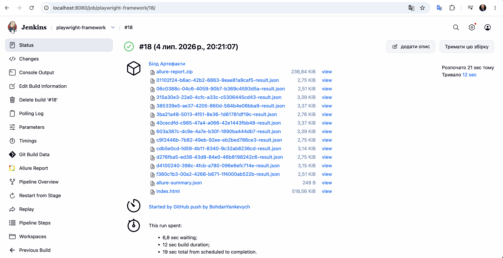
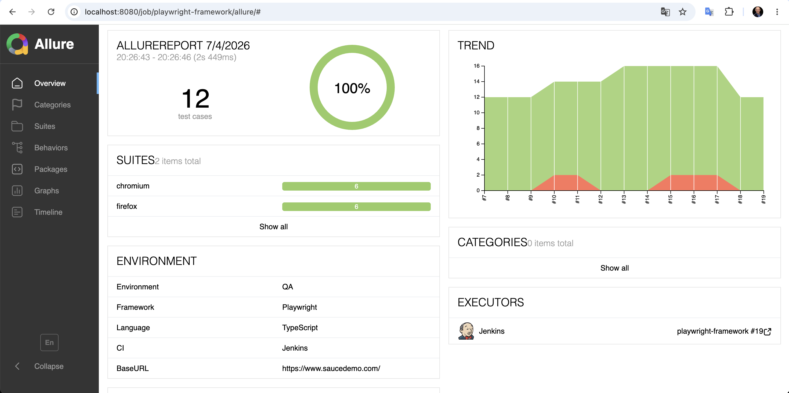
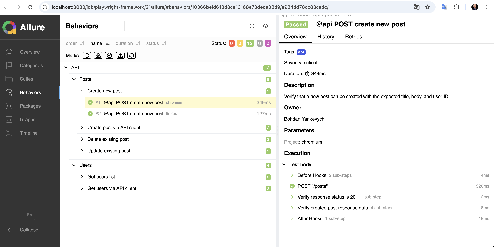

# Playwright TypeScript Automation Framework

A modern UI and API test automation framework built with **Playwright**, **TypeScript**, **Jenkins**, and **Allure Report**.

---

## Features

- UI automation with Playwright
- API testing
- Page Object Model (POM)
- Data-driven testing
- Custom Playwright fixtures
- Allure reporting
- Jenkins CI/CD pipeline
- GitHub Webhooks
- Cross-browser execution
- Environment configuration using `.env`
- Automatic screenshots, videos, and traces on failures

---

## Tech Stack

- Playwright
- TypeScript
- Node.js
- Jenkins
- Allure Report
- GitHub
- ngrok
- Axios
- dotenv

---

## Project Structure

```text
.
├── api/
├── docs/
│   └── images/
├── fixtures/
├── pages/
├── test-data/
├── tests/
│   ├── api/
│   ├── saucedemo-login.spec.ts
│   ├── negative-login.spec.ts
│   └── data-driven-login.spec.ts
├── playwright.config.ts
├── Jenkinsfile
├── Dockerfile
├── docker-compose.yml
├── package.json
└── README.md
```

---

## Installation

Clone the repository

```bash
git clone https://github.com/BohdanYankevych/playwright-typescript-automation-framework.git
```

Go to the project

```bash
cd playwright-typescript-automation-framework
```

Install dependencies

```bash
npm install
```

Install Playwright browsers

```bash
npx playwright install
```

---

## Environment Variables

Create a `.env` file.

```env
BASE_URL=https://www.saucedemo.com/
USERNAME=standard_user
PASSWORD=secret_sauce
```

---

## Running Tests

Run all tests

```bash
npx playwright test
```

Run smoke tests

```bash
npx playwright test --grep @smoke
```

Run regression tests

```bash
npx playwright test --grep @regression
```

Run API tests

```bash
npx playwright test --grep @api
```

Run tests in headed mode

```bash
npx playwright test --headed
```

---

## Docker

Build Docker image

```bash
docker build -t playwright-framework .
```

Run API tests inside Docker

```bash
docker run --rm playwright-framework
```

Run using Docker Compose

```bash
docker compose up --build
```

---

## Reports

Generate Allure report

```bash
allure generate allure-results --clean
```

Open Allure report

```bash
allure open allure-report
```

Open Playwright HTML report

```bash
npx playwright show-report
```

---

# Test Reports

## Jenkins Build



## Allure Overview



## Allure Test Details



---

## Jenkins Pipeline

The project includes a Declarative Jenkins Pipeline.

Pipeline stages:

- Checkout
- Clean Previous Results
- Install Dependencies
- Install Browsers
- Run Tests
- Generate Allure Report

Pipeline supports running:

- API tests
- Smoke tests
- Regression tests
- Full test suite

using Jenkins parameters.

---

## Allure Features

The framework generates rich Allure reports with:

- Epic
- Feature
- Story
- Owner
- Severity
- Description
- Test Steps
- Environment information
- Screenshots
- Videos
- Traces
- Categories
- Trends
- Executors

---

## GitHub Webhook

Every push to the `main` branch automatically:

1. Triggers GitHub Webhook
2. Starts Jenkins Pipeline
3. Executes Playwright tests
4. Generates Allure Report

No manual build is required.

---

## CI/CD Flow

```text
Developer
     │
 git push
     │
     ▼
 GitHub
     │
 GitHub Webhook
     │
     ▼
 ngrok
     │
     ▼
 Jenkins
     │
     ▼
 Playwright Tests
     │
     ▼
 Allure Report
```

---

## Example Commands

```bash
npm test
```

```bash
npx playwright test --grep @smoke
```

```bash
npx playwright test --grep @api
```

```bash
npx playwright show-report
```

---

## Author

**Bohdan Yankevych**

QA Automation Engineer

GitHub:
https://github.com/BohdanYankevych