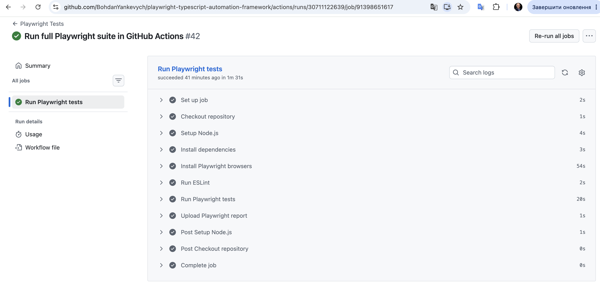
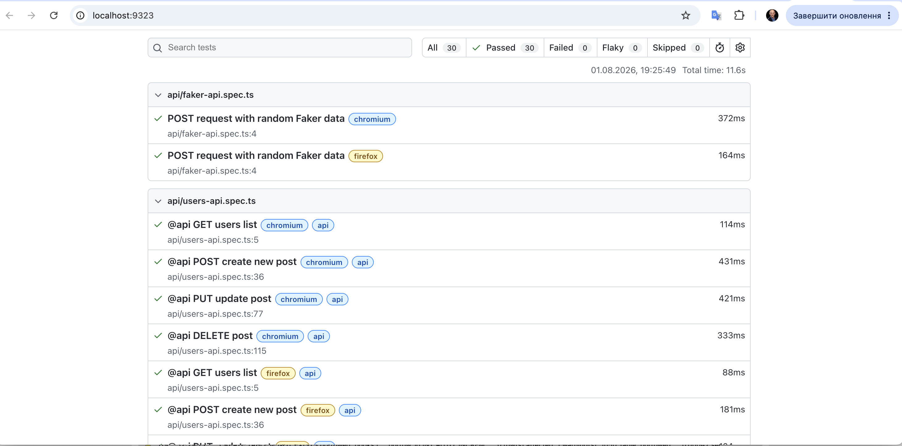

# 🚀 Playwright TypeScript Automation Framework

[](https://github.com/BohdanYankevych/playwright-typescript-automation-framework/actions/workflows/playwright.yml)

A scalable UI & API automation framework built with **Playwright** and **TypeScript**, showcasing modern test automation architecture, clean code principles, and industry-standard design patterns.
## 🎯 About the Project

This project was created to demonstrate how a modern automation framework can be built using **Playwright** and **TypeScript** while following clean architecture principles.

The framework focuses on scalability, maintainability, reusability, and real-world automation practices commonly used in professional QA teams.


---

## 🌟 Project Highlights

- 🧩 Built using **Page Object Model (POM)** and **Component Object Pattern**
- ⚡ Supports **UI** and **API** testing in a single framework
- 🏭 Uses **Factory Pattern** and strongly typed **TypeScript Models**
- 🎭 Powered by **Playwright Fixtures** for dependency injection
- 🤖 Automated with **GitHub Actions** CI
- 📊 Integrated with **Allure Report**
- 🧹 Enforces code quality with **ESLint**
- 🌍 Cross-browser execution (**Chromium** & **Firefox**)

---

# 🛠 Tech Stack

| Technology | Purpose |
|------------|---------|
| Playwright | UI & API Test Automation |
| TypeScript | Strong typing and maintainability |
| Node.js | Runtime environment |
| GitHub Actions | Continuous Integration |
| Allure Report | Test reporting |
| Faker.js | Dynamic test data generation |
| ESLint | Code quality and static analysis |

---

# 📁 Project Structure

| Folder | Description |
|---------|-------------|
| `.github/workflows` | GitHub Actions CI configuration |
| `components` | Reusable UI components |
| `config` | Environment configuration |
| `constants` | Project constants |
| `factories` | Test data factories |
| `fixtures` | Playwright fixtures and dependency injection |
| `models` | TypeScript domain models |
| `pages` | Page Object Model classes |
| `test-data` | Static test data |
| `tests` | UI and API test suites |

---

# 🏗 Framework Architecture

```
Tests
   │
   ▼
Fixtures
   │
   ▼
Page Objects
   │
   ▼
Components
   │
   ▼
BasePage / BaseComponent
   │
   ▼
Playwright
```

---

# ✨ Design Patterns Used

### ✅ Page Object Model

Keeps UI interactions isolated from test logic.

---

### ✅ Component Object Pattern

Reusable UI components shared across multiple pages.

Example:

- Burger Menu
- Navigation
- Header
- Footer

---

### ✅ Factory Pattern

Generates reusable test data.

Example:

```ts
const customer = CustomerFactory.default();
```

---

### ✅ Model Pattern

Strongly typed business objects.

Example:

```ts
Customer
```

instead of

```ts
{
    firstName: "...",
    lastName: "...",
    postalCode: "..."
}
```

---

### ✅ Fixtures

Dependency Injection for page objects.

Example:

```ts
test('Example', async ({
    loginPage,
    inventoryPage,
    cartPage,
}) => {

});
```

---

# 🚀 Installation

Clone repository

```bash
git clone https://github.com/BohdanYankevych/playwright-typescript-automation-framework.git
```

Install dependencies

```bash
npm install
```

Install Playwright browsers

```bash
npx playwright install
```

---

# ⚙ Environment Variables

Create a `.env` file in the project root.

```bash
BASE_URL=https://www.saucedemo.com
USERNAME=standard_user
PASSWORD=secret_sauce
```

---

# ▶ Running Tests

Run all tests

```bash
npx playwright test
```

Run UI tests

```bash
npx playwright test tests/
```

Run API tests

```bash
npx playwright test tests/api
```

Run Chromium only

```bash
npx playwright test --project=chromium
```

Run headed

```bash
npx playwright test --headed
```

Debug tests

```bash
npx playwright test --debug
```

---

# 📊 Allure Report

Generate report

```bash
allure generate allure-results --clean
```

Open report

```bash
allure open
```

---

# ✅ Code Quality

Run ESLint

```bash
npm run lint
```

---

# 🔄 Continuous Integration

The project includes GitHub Actions.

Workflow automatically:

- Installs Node.js
- Installs dependencies
- Installs Playwright browsers
- Runs ESLint
- Executes Playwright tests
- Uploads Playwright HTML Report

Workflow location:

```
.github/workflows/playwright.yml
```

---

# 📊 Latest Results

| Check | Status |
|-------|--------|
| UI Tests | ✅ Passed |
| API Tests | ✅ Passed |
| Cross-browser Testing | ✅ Chromium & Firefox |
| ESLint | ✅ Passed |
| GitHub Actions | ✅ Passing |
| Playwright Report | ✅ Generated |

---

# 📈 Test Coverage

| Area | Covered Scenarios |
|------|-------------------|
| Authentication | Valid login, invalid login |
| Inventory | Add product to cart |
| Cart | Verify cart contents |
| Checkout | Customer information |
| Purchase | End-to-end purchase flow |
| API | GET and POST requests |
| Test Data | Faker-generated dynamic data |

---

# 🎯 Key Features

- ✅ UI and API testing in a single framework
- ✅ Cross-browser execution (Chromium & Firefox)
- ✅ Page Object Model (POM)
- ✅ Component Object Pattern
- ✅ Factory Pattern
- ✅ Strongly typed TypeScript Models
- ✅ Playwright Fixtures for dependency injection
- ✅ Locator-based BasePage architecture
- ✅ Environment-based configuration
- ✅ Parallel test execution
- ✅ GitHub Actions Continuous Integration
- ✅ Allure Reporting
- ✅ ESLint code quality checks

---

# 💡 Skills Demonstrated

- Test Automation Framework Design
- Playwright UI Automation
- Playwright API Testing
- TypeScript Development
- Page Object Model (POM)
- Component Object Pattern
- Factory Pattern
- Dependency Injection with Fixtures
- Cross-browser Testing
- Continuous Integration with GitHub Actions
- Test Reporting with Allure
- Clean Code & Maintainable Architecture

---

# 📸 Project Preview

## ✅ GitHub Actions Pipeline

The project is automatically validated on every push and pull request.



---

## 📊 Playwright HTML Report

Automatically generated HTML report after each test execution.



---

# 👨‍💻 Author

**Bohdan Yankevych**

Automation QA Engineer

GitHub: https://github.com/BohdanYankevych

---

## 📄 License

This project is intended for learning and portfolio purposes.